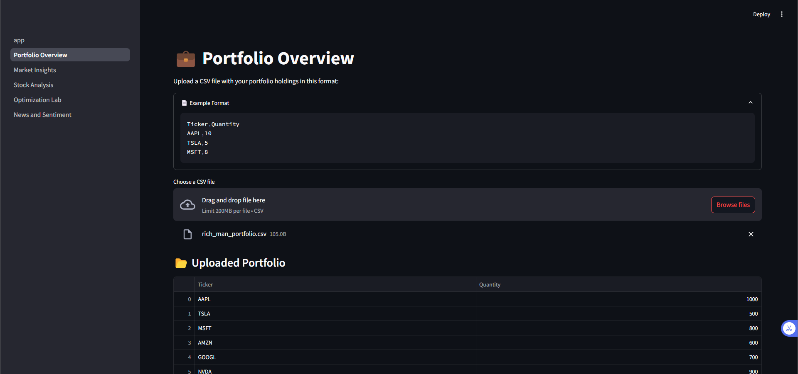
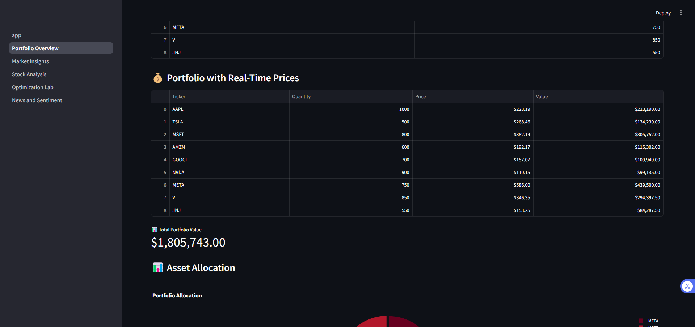
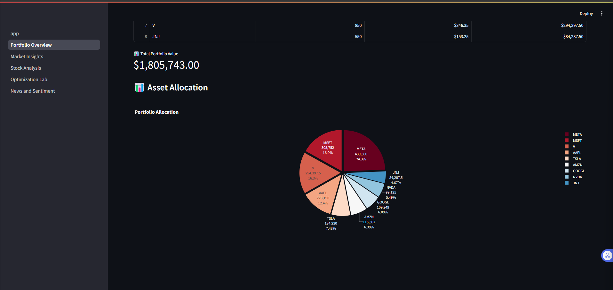
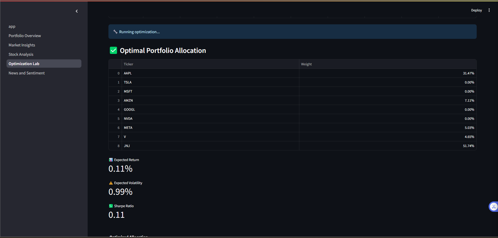
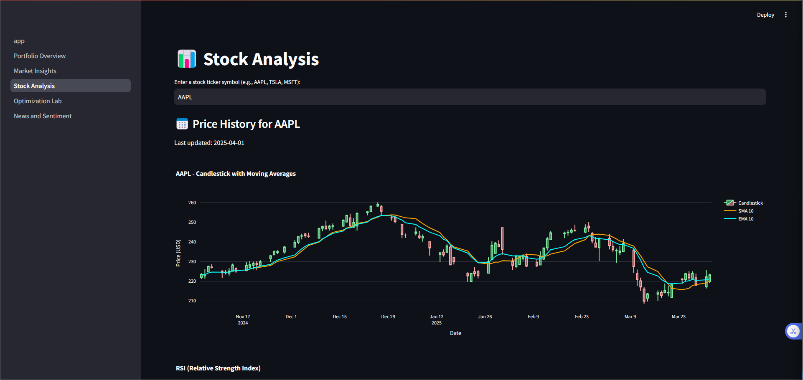
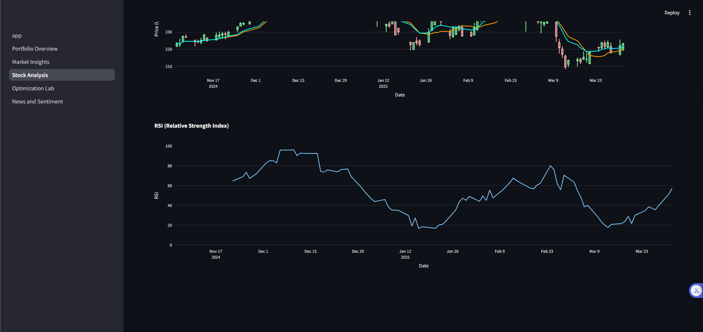
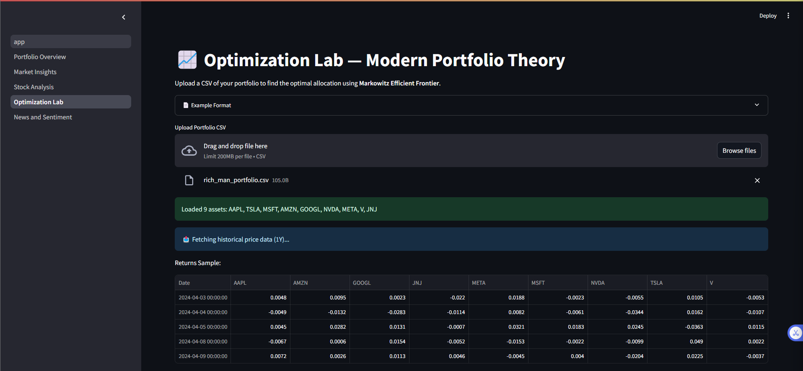
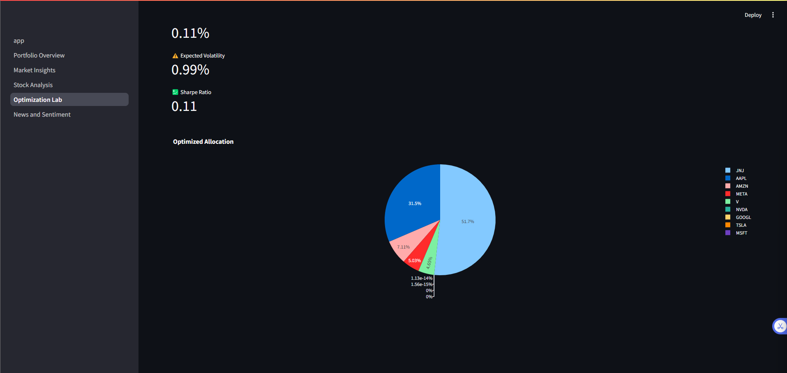
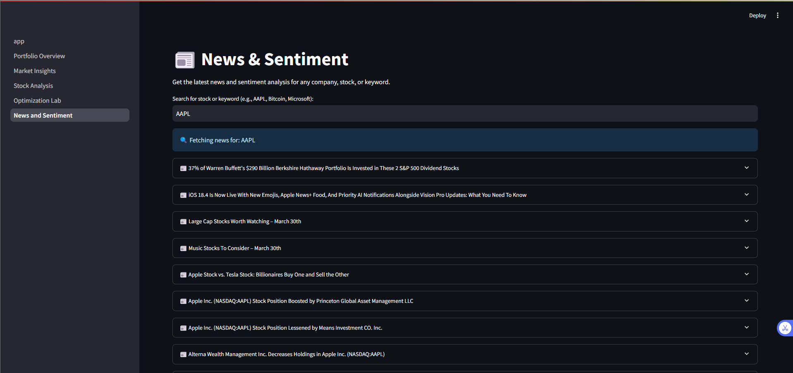
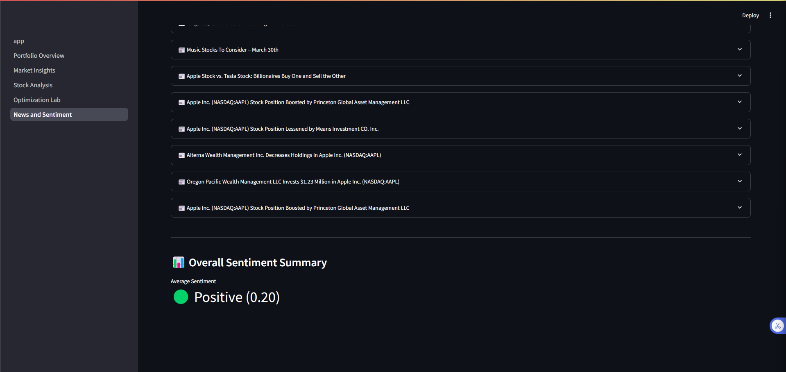

# 📊 FinSight: Real-Time Finance Dashboard


**FinSight** is a professional-grade, real-time finance dashboard for investors, analysts, and students.  
Built with Streamlit, Plotly, and multiple APIs, it provides live insights, technical analysis, portfolio optimization, and sentiment analysis — all in one place.

---

### 🚀 Live Demo  
👉 [Click here to explore the live app](https://fin-dashboard-djx73uumq4pjhejxsvlyj8.streamlit.app/)

---

## 📸 Screenshots

### 1️⃣ Portfolio Overview
Upload your CSV portfolio and get real-time valuation + visual table.

  
  


---

### 2️⃣ Market Insights
Track global ETF indices, top gainers and losers in real-time.



---

### 3️⃣ Stock Analysis
Analyze individual stocks with candlestick charts, RSI, SMA, and EMA overlays.

  


---

### 4️⃣ Optimization Lab (MPT)
Run Modern Portfolio Theory to optimize your asset allocation using Sharpe Ratio.

  


---

### 5️⃣ News & Sentiment
Fetch real-time financial news and run NLP-powered sentiment analysis.

  


---

## 🚀 Features

| Module                | Description                                                                  |
|------------------------|------------------------------------------------------------------------------|
| **Portfolio Overview** | Upload a CSV and visualize real-time value with Plotly                      |
| **Market Insights**    | Live global ETF prices, market gainers/losers                                |
| **Stock Analysis**     | Ticker chart with candlesticks, SMA/EMA, RSI                                 |
| **Optimization Lab**   | Markowitz Efficient Frontier optimizer (maximize Sharpe Ratio)              |
| **News & Sentiment**   | NLP sentiment on financial headlines using TextBlob & NewsData.io           |

---

## ⚙️ Tech Stack

- **Frontend:** Streamlit + Plotly
- **Backend:** Python
- **Data APIs:**
  - [Financial Modeling Prep](https://financialmodelingprep.com/)
  - [Yahoo Finance via yFinance](https://pypi.org/project/yfinance/)
  - [NewsData.io](https://newsdata.io/)
- **NLP:** TextBlob
- **Others:** pandas, numpy, scipy, requests

---

## 🧪 CSV Format Example

```csv
Ticker,Quantity
AAPL,10
TSLA,5
MSFT,8
